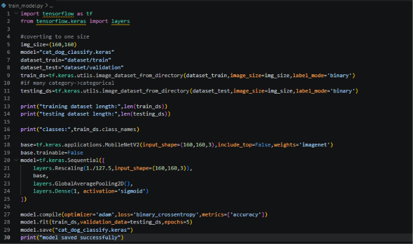
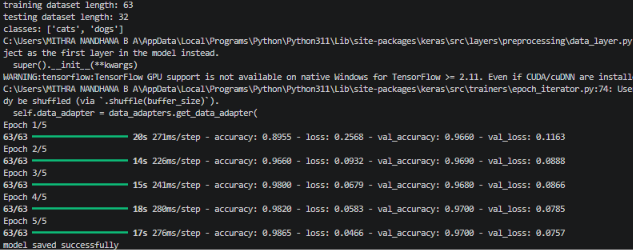
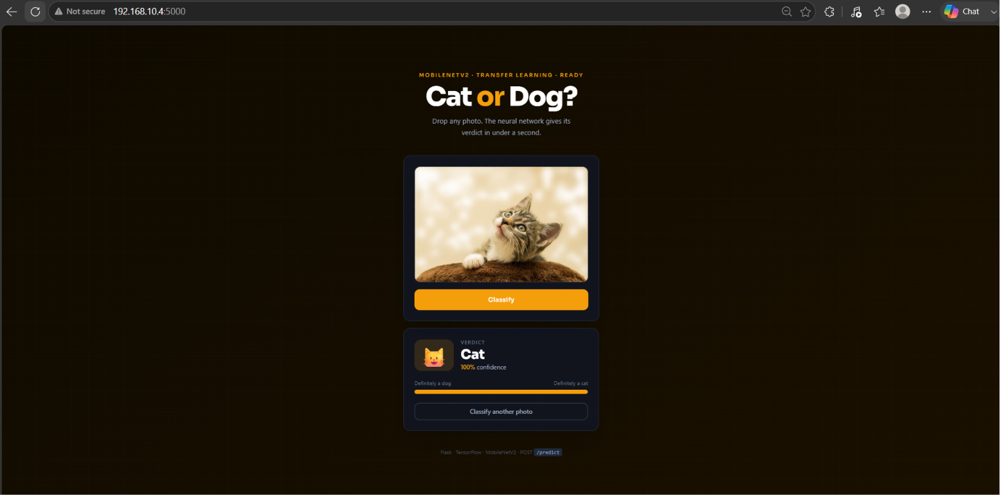
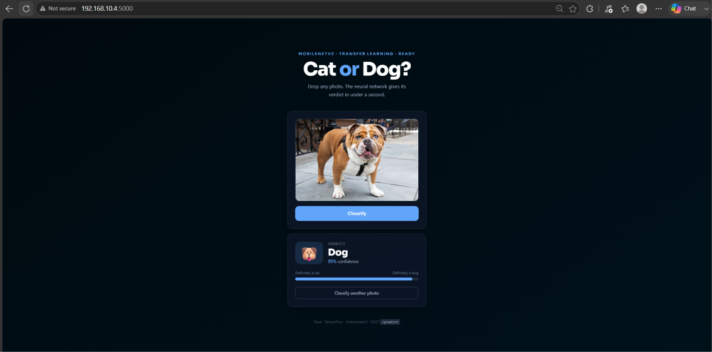

# IMAGE-CLASSIFICATION
Image classification using MobileNet and Flask API by Mithra Nandhana  

## Problem Statement
Develop a Cat and Dog Image Classification Web Application using Deep Learning (MobileNet) and deploy it using a Flask API.

## Answer
Below,
1. Implementation of the image classification model is done using Python (TensorFlow/Keras). The code is saved in `IMAGE-CLASSIFICATION/` along with the training script `train_model.py` and the saved model `cat_dog_classify.keras`.

The code and the output along with the prediction are given below.
## *Source Code*

## *Output*

## *WEB APP PREDICTION*

2. A Flask web app was also built so the model can be used by uploading images through a browser instead of the command line. The code is saved in the folder, containing `app.py`, `templates/index.html`. A demo recording of the web app is available below.
   
## *Web App*
[Watch the recording](output/Recording%2026-07-19%021621.mp4)

## Final Answer
Given an input image, the model predicts whether it is a Cat 🐱 or a Dog 🐶 along with the confidence percentage.

# What I Learned
By this assignment and class, I learned:
1. Image Classification
2. Using MobileNetV2

:D
